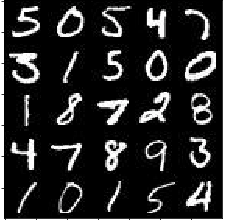
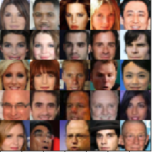
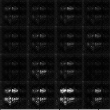
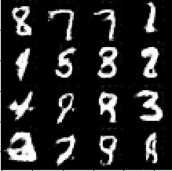
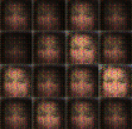
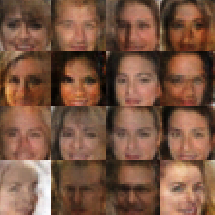

# Face Generation With Generative Adversarial Networks

## Summary

In this project, we will use generative adversarial networks (GANs) to generate new images of faces. To do this, we will use TensorFlow to implement a generator to create images using a function and also implement a discriminator that attempts to differentiate between real and generated images.

## Data

 

Two datasets were used for this project, [MNIST](http://yann.lecun.com/exdb/mnist/) and [CelebA](http://mmlab.ie.cuhk.edu.hk/projects/CelebA.html). MNIST contains black and white images of handwritten digits (single color channel), while CelebA contains more than 200k celebrity images (3 color channels). The MNIST dataset was used to test the neural network before moving on to the more computationally intensive CelebA dataset.

## Discriminator

```python
def discriminator(images, reuse=False, alpha=0.01):
    """
    Create the discriminator network
    :param images: Tensor of input image(s)
    :param reuse: Boolean if the weights should be reused
    :return: Tuple of (tensor output of the discriminator, tensor logits of the discriminator)
    """
    # Images are going to be 28x28xNumber_Channels (depending on color or grayscale)
    with tf.variable_scope('discriminator', reuse=reuse):
        # Input layer is 28x28x3 for celeba and 28x28x1 for MNIST
        x1 = tf.layers.conv2d(images, 64, 5, strides=2, padding='same', kernel_initializer = tf.contrib.layers.xavier_initializer())
        relu1 = tf.maximum(alpha * x1, x1)
        # 14x14x64. strides narrow the height and width by factor of 2 and number of filters brings us to 64

        # Included dropout to make discriminator less prone to mistakes the generator can exploit
        x2 = tf.layers.conv2d(relu1, 128, 5, strides=2, padding='same')
        bn2 = tf.layers.batch_normalization(x2, training=True)
        drop2 = tf.layers.dropout(bn2)
        relu2 = tf.maximum(alpha * drop2, drop2)
        # 7x7x128

        x3 = tf.layers.conv2d(relu2, 256, 5, strides = 2, padding='same')
        bn3 = tf.layers.batch_normalization(x3, training=True)
        drop3 = tf.layers.dropout(bn3)
        relu3 = tf.maximum(alpha * drop3, drop3)
        # 4x4x256  due to ceil function of 7/2 rounds up to 4

        flat = tf.reshape(relu3, (-1, 4*4*256))
        logits = tf.layers.dense(flat, 1)
        out = tf.sigmoid(logits)

        return out, logits
```

In our discriminator, we'll stack multiple convolutions and rectified linear units (ReLUs). To help with generalization and improve performance, we'll use batch normalization and dropout.

## Loss

```python
# Used label smoothing for discriminator to generalize better
d_loss_real = tf.reduce_mean(
    tf.nn.sigmoid_cross_entropy_with_logits(logits=d_logits_real, labels=tf.ones_like(d_model_real) * (1 - smooth)))
d_loss_fake = tf.reduce_mean(
    tf.nn.sigmoid_cross_entropy_with_logits(logits=d_logits_fake, labels=tf.zeros_like(d_model_fake)))
g_loss = tf.reduce_mean(
    tf.nn.sigmoid_cross_entropy_with_logits(logits=d_logits_fake, labels=tf.ones_like(d_model_fake)))

d_loss = d_loss_real + d_loss_fake
```

One of the most interesting parts of the GAN is the loss function, which features a discriminator and a generator loss. The discriminator loss is made up of two parts, one for the real inputs and one for the generated inputs. In the above code snippet for the two parts of the discriminator loss, the ground truth labels differ with tf.ones_like and tf.zeros_like.

## Results

Here are the results before and after training.

 

After two epochs, the GAN could already generate images that look like handwritten digits.

 

Due to the large data size, an average GPU took about 20 minutes to run one epoch on the CelebA dataset. These are the faces the GAN could generate after only one epoch!
